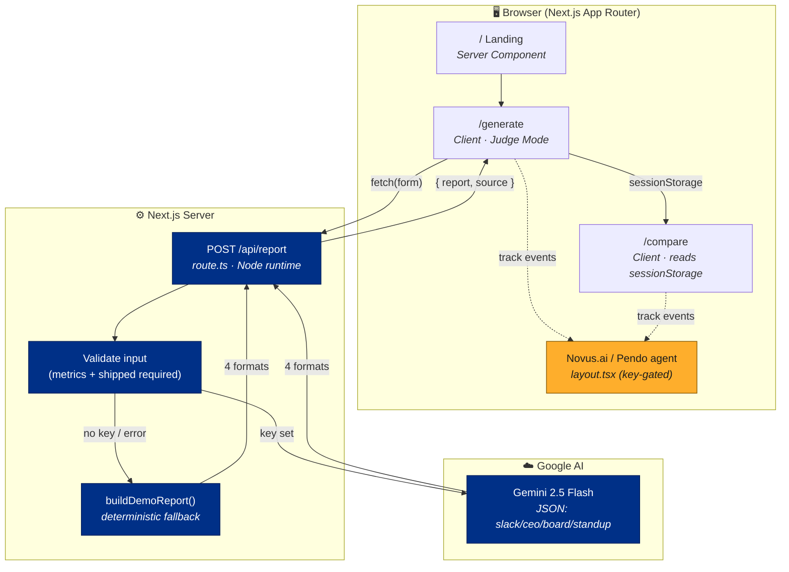

<div align="center">

# 📊 PulseReport

### Your weekly product update. 60 seconds. Every format.

Paste your week once → get an audience-tuned update in **four** formats:
**Slack · CEO email · Board slide · Engineering standup.**

Built for the **Mind the Product** hackathon · World Product Day 2026 · _Everyone Ships Now_

<br/>

[](https://nextjs.org/)
[](https://react.dev/)
[](https://www.typescriptlang.org/)
[](https://tailwindcss.com/)
[](https://ai.google.dev/)
[](https://novus.pendo.io/)
[](https://vercel.com/)
[](#license)

**▶ Live: [pulsereport-tan.vercel.app](https://pulsereport-tan.vercel.app)**  ·  **🧑‍⚖️ Judge demo: [/generate?demo=1](https://pulsereport-tan.vercel.app/generate?demo=1)**

</div>

---

## 🧑‍⚖️ Judge Mode — one-click demo

No typing on stage. Open **[`/generate?demo=1`](http://localhost:3000/generate?demo=1)** and PulseReport
pre-loads a realistic PM week and **generates all four formats automatically**.

| Trigger | What happens |
| --- | --- |
| `/generate?demo=1` (or `?demo=judge`) | Auto-fills the canonical sample week + runs generation on load, with a "Judge Mode" banner |
| **Try sample** button (top-right of `/generate`) | Loads the same dataset on demand, then generates |
| Landing → **"Judge? One-click demo"** | Same as `?demo=1` |

---

## ✨ What it does

- **One input, four audiences.** Each format is written _for_ its reader — not adapted from a template.
- **Real numbers, honest risks.** The Gemini prompt is tuned by a PM, for PMs: specific over vague, one clear recommendation, no buzzwords.
- **Side-by-side compare** ([`/compare`](http://localhost:3000/compare)) with live word counts and one-click "Share all".
- **Bulletproof demo.** Works with **zero secrets** — no Gemini key → a deterministic demo report keeps the UI alive.
- **Product analytics built in.** Novus.ai (Pendo) tracks how PMs actually use it.

## 🗺️ Routes

| Route       | Screen                                                          |
| ----------- | -------------------------------------------------------------- |
| `/`         | Landing — hero, signature pulse line, stats, bento showcase    |
| `/generate` | The app — paste your week, generate, copy any format (+ Judge Mode) |
| `/compare`  | All four formats side by side with word counts + "Share all"   |
| `/api/report` | `POST` → Gemini generation (JSON), with demo fallback        |

## 🏗️ Architecture



A fuller breakdown lives in **[docs/ARCHITECTURE.md](docs/ARCHITECTURE.md)**.

## 🚀 Getting started

```bash
npm install
cp .env.local.example .env.local   # add your keys (optional)
npm run dev                        # http://localhost:3000
```

### Environment variables

| Variable                    | Purpose                                                                       |
| --------------------------- | ----------------------------------------------------------------------------- |
| `GEMINI_API_KEY`            | Google Generative AI key. **Omit it and the app uses a built-in demo report** so the UI/demo never breaks. |
| `GEMINI_MODEL`              | Optional model override (default `gemini-2.5-flash`).                          |
| `NEXT_PUBLIC_NOVUS_API_KEY` | Pendo/Novus.ai agent key. When empty, analytics calls are safe no-ops.        |

## 📈 Analytics events (the Novus.ai story)

`report_generated` · `format_copied` · `format_switched` · `report_shared` · `sample_loaded`

These power the submission narrative — _which format wins, which section gets edited, how long judges read before copying._ Each `report_generated` event carries a `judge_mode` flag so demo traffic is separable from real usage.

## 🎨 Design system

"Financial Brutalism" — The Economist / Bloomberg for PMs. Tokens (navy `#003087`, amber pulse
`#F5A623`, warm-cream canvas) live in [`tailwind.config.ts`](tailwind.config.ts), ported verbatim
from the Stitch design export. Signature element: the 2px amber **pulse line**.

## 🛠️ Tech stack

| Layer       | Choice                                            |
| ----------- | ------------------------------------------------- |
| Framework   | Next.js 15 (App Router) + React 19                |
| Language    | TypeScript 5.7 (strict)                           |
| Styling     | Tailwind CSS 3.4 + Material Symbols + Inter       |
| AI          | Google Gemini 2.5 Flash (`@google/generative-ai`) |
| Analytics   | Novus.ai / Pendo                                  |
| Hosting     | Vercel                                            |

## ☁️ Deploy to Vercel

```bash
npm i -g vercel
vercel            # preview
vercel --prod     # production
```

Set the three env vars in the Vercel project settings. That's it.

## License

MIT © Manoj Mallick (LearnHubPlay BV, Amsterdam) · `#EveryoneShipsNow`
