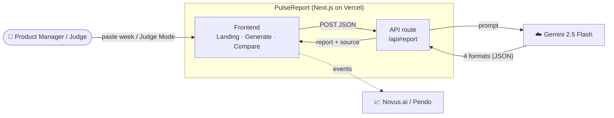
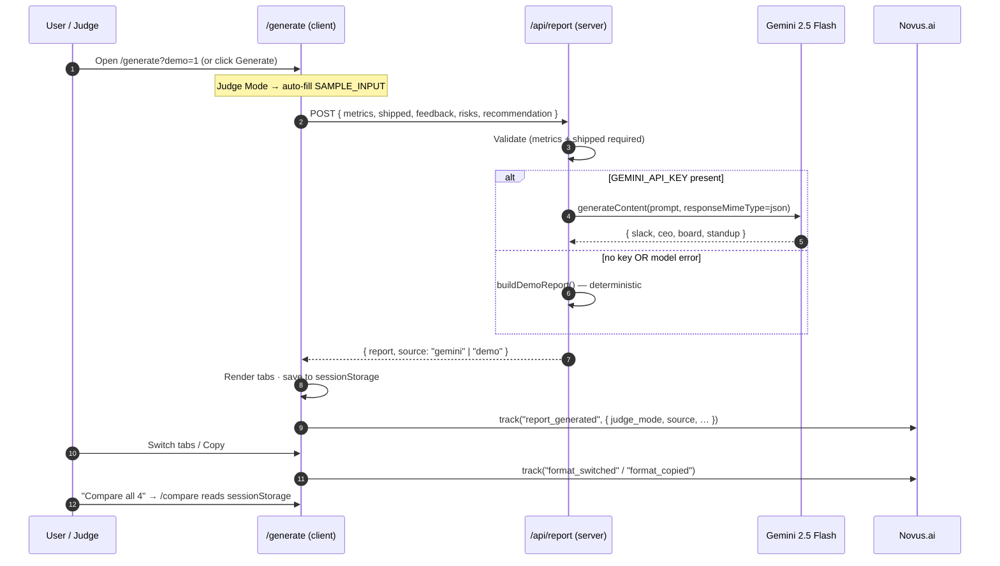

# PulseReport — Architecture

PulseReport is a single Next.js 15 (App Router) application. The browser renders
three screens; one API route does the AI work; everything degrades gracefully so
a live demo can never hard-fail.

## 1. System context



## 2. Request lifecycle (generate)



## 3. Component map

| Layer | File | Responsibility |
| --- | --- | --- |
| Root layout | `app/layout.tsx` | Fonts (Inter, Material Symbols), Novus.ai/Pendo init (key-gated) |
| Landing | `app/page.tsx` | Server Component — hero, pulse line, stats, bento, judge link |
| Generate | `app/generate/page.tsx` | Client — form, generation, Judge Mode, tabs, copy |
| Compare | `app/compare/page.tsx` | Client — reads `sessionStorage`, 4-up grid, word counts |
| API | `app/api/report/route.ts` | Node runtime — validate → Gemini → JSON, demo fallback |
| Prompt + fallback | `lib/demoReport.ts` | Deterministic 4-format report when AI is unavailable |
| Types + sample | `lib/types.ts` | `Report`, `ReportInput`, `FORMATS`, `SAMPLE_INPUT` |
| Analytics | `lib/analytics.ts` | `trackEvent()` — safe no-op wrapper over Pendo |
| Shared UI | `components/*` | `TopNav`, `Footer`, `PulseLine`, `Icon` |

## 4. Design decisions

- **Demo fallback over hard failure.** `/api/report` always returns a usable report
  (HTTP 200) — even with no API key or a model error — so the on-stage demo is safe.
  The response `source` field (`gemini` \| `demo`) tells the UI which path ran.
- **Client→client handoff via `sessionStorage`.** `/compare` reads the last generation
  written by `/generate`, avoiding a backend store for a hackathon-scope app. Falls back
  to a sample report when opened cold.
- **Judge Mode is a query param, not a build.** `?demo=1` keeps one codebase; demo
  traffic is tagged via the `judge_mode` analytics flag so it's separable from real usage.
- **Key-gated analytics.** The Pendo agent only loads when `NEXT_PUBLIC_NOVUS_API_KEY`
  is set; `trackEvent()` is a no-op otherwise, so nothing throws in dev or in CI.

## 5. Data shapes

```ts
interface ReportInput {
  metrics: string;        // required
  shipped: string;        // required
  feedback: string;
  risks: string;
  recommendation: string;
}

interface Report {
  slack: string;
  ceo: string;
  board: string;
  standup: string;
}

// POST /api/report → { report: Report; source: "gemini" | "demo" }
//                  → 400 { error } when metrics/shipped missing
```
